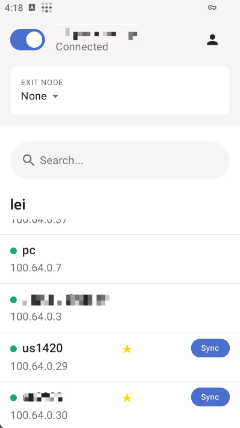

# Tailscale with Amnezia-WG 1.5

[](https://github.com/LiuTangLei/tailscale/releases/latest)
[](https://github.com/LiuTangLei/tailscale/releases/latest)
[](LICENSE)

Enhanced Tailscale client with **Amnezia-WG 1.5** obfuscation: junk traffic, protocol signatures, and handshake/header masquerading to resist DPI and blocking. Acts like vanilla Tailscale until you enable AWG features.

**📚 Languages:** [English](README.md) | [中文](doc/README-zh.md) | [فارسی](doc/README-fa.md) | [Русский](doc/README-ru.md)

## 🚀 Installation

| Platform                   | Command / Action                                                                                                 |
| -------------------------- | ---------------------------------------------------------------------------------------------------------------- |
| Linux                      | `curl -fsSL https://raw.githubusercontent.com/LiuTangLei/tailscale-awg-installer/main/install-linux.sh \| bash`  |
| macOS                      | `curl -fsSL https://raw.githubusercontent.com/LiuTangLei/tailscale-awg-installer/main/install-macos.sh \| bash`  |
| Windows (Admin PowerShell) | `iwr -useb https://raw.githubusercontent.com/LiuTangLei/tailscale-awg-installer/main/install-windows.ps1 \| iex` |
| Android                    | Download APK: [releases](https://github.com/LiuTangLei/tailscale-android/releases)                               |

Android build currently supports AWG config sync (receive) from another configured node. Use the in‑app Sync button:



### Mirrors (optional)

Self-host a prefix mirror (e.g. `https://your-mirror-site.com`) via [gh-proxy](https://github.com/hunshcn/gh-proxy) if GitHub is slow/blocked:

```bash
# Linux
curl -fsSL https://your-mirror-site.com/https://raw.githubusercontent.com/LiuTangLei/tailscale-awg-installer/main/install-linux.sh | bash -s -- --mirror https://your-mirror-site.com

# macOS
curl -fsSL https://your-mirror-site.com/https://raw.githubusercontent.com/LiuTangLei/tailscale-awg-installer/main/install-macos.sh | bash -s -- --mirror https://your-mirror-site.com
```

```powershell
# Windows
$scriptContent = (iwr -useb https://your-mirror-site.com/https://raw.githubusercontent.com/LiuTangLei/tailscale-awg-installer/main/install-windows.ps1).Content; $scriptBlock = [scriptblock]::Create($scriptContent); & $scriptBlock -MirrorPrefix 'https://your-mirror-site.com/'
```

PowerShell policy (if blocked): `Set-ExecutionPolicy RemoteSigned` (or `Bypass -Scope Process`)

## ⚡ Quick Start

> Tip: `tailscale amnezia-wg` → `tailscale awg` (alias)

1. Login:

```bash
# Official
tailscale up
# Headscale
tailscale up --login-server https://your-headscale-domain
```

1. First device (generate shared core values):

```bash
tailscale awg set
```

Enter `random` for H1–H4 to auto-generate secure 32‑bit values.

1. Sync other devices:
   - Desktop: `tailscale awg sync`
   - Android: tap Sync button (see screenshot above)
1. Optional per-device tuning: rerun `tailscale awg set` and change only non-shared fields (leave S1/S2/H1–H4 unchanged).
1. Useful:

```bash
tailscale awg get     # show JSON
tailscale awg reset   # revert to vanilla WireGuard
```

## 🛡️ Features

### Junk Traffic & Signatures

Add fake packets and protocol signatures to evade DPI. Compatible with standard Tailscale peers:

```bash
# Basic junk traffic
tailscale awg set '{"jc":4,"jmin":64,"jmax":256}'

# With protocol signatures (i1-i5)
tailscale awg set '{"jc":2,"jmin":64,"jmax":128,"i1":"<b 0xc0><r 16>","i2":"<b 0x40><r 12>"}'
```

### Protocol Masquerading

Requires ALL nodes to use this fork with identical settings (ix signatures do NOT require matching):

```bash
# Handshake obfuscation (s1/s2 must match on all nodes)
tailscale awg set '{"s1":10,"s2":15}'

# With header fields (h1-h4 for protocol obfuscation, must match on all nodes)
tailscale awg set '{"s1":10,"s2":15,"h1":3946285740,"h2":1234567890,"h3":987654321,"h4":555666777}'

# Combined with signatures (i1-i5 can be different per node)
tailscale awg set '{"s1":10,"s2":15,"h1":3946285740,"h2":1234567890,"h3":987654321,"h4":555666777,"i1":"<b 0xc0><r 32><c><t>"}'
```

## 🎯 Configuration

Basic (works with standard clients):

| Type             | JSON                                                  | Compatible |
| ---------------- | ----------------------------------------------------- | ---------- |
| Junk only        | `{"jc":4,"jmin":64,"jmax":256}`                       | ✅ Yes     |
| Junk + Signature | `{"jc":2,"jmin":64,"jmax":128,"i1":"<b 0xc0><r 16>"}` | ✅ Yes     |

Advanced (all nodes must use this fork & share S1/S2/H1–H4):

| Purpose            | Example                                                                                          | Notes                    |
| ------------------ | ------------------------------------------------------------------------------------------------ | ------------------------ |
| Handshake prefixes | `{"s1":10,"s2":15}`                                                                              | s1/s2: 0–64 bytes        |
| Header obfuscation | `{"s1":10,"s2":15,"h1":123456,"h2":789012,"h3":345678,"h4":901234}`                              | set all h1–h4            |
| Combined           | `{"jc":2,"s1":10,"s2":15,"h1":123456,"h2":789012,"h3":345678,"h4":901234,"i1":"<b 0xc0><r 16>"}` | junk/signatures optional |

Parameters:

- jc (0–10) with jmin/jmax (64–1024): junk packet count & size range
- i1–i5: optional signature chain (hex-format mini language)
- s1/s2 (0–64 bytes): handshake padding prefixes (must match across all AWG nodes)
- h1–h4 (32‑bit ints): header obfuscation (all or none; must match). Pick random unique values (suggest 5–2147483647)

Notes: very large junk counts or long signature chains increase latency & bandwidth.

## 📊 Platform Support

| Platform | Arch                 | Status                 |
| -------- | -------------------- | ---------------------- |
| Linux    | x86_64, ARM64        | ✅ Full                |
| macOS    | Intel, Apple Silicon | ✅ Full                |
| Windows  | x86_64, ARM64        | ✅ Installer           |
| Android  | ARM64, ARM           | ✅ APK (sync-only AWG) |

## 🔄 Migration from Official Tailscale

1. Run the installer - automatically replaces binaries while preserving your settings
2. Your existing authentication and configuration remain unchanged
3. Start with basic obfuscation: `tailscale awg set '{"jc":4,"jmin":64,"jmax":256}'`

## ⚠️ Notes

- Vanilla until AWG config is applied
- Junk/signatures interoperate with standard clients (per-node values may differ)
- s1/s2 & h1–h4 require every communicating node to share identical values
- Keep configs backed up (use `tailscale awg get`)

## 🛠️ Advanced Usage

### Header Field Configuration (h1-h4)

Protocol obfuscation to evade WireGuard detection. Must set all 4 values or none:

```bash
# First node: generate random values (enter 'random' for each h1-h4)
tailscale awg set  # Set all h1, h2, h3, h4 when prompted

# Get the configuration JSON
tailscale awg get

# Copy the entire JSON to other nodes (must include all h1-h4)
tailscale awg set '{"s1":10,"s2":15,"h1":3946285740,"h2":1234567890,"h3":987654321,"h4":555666777}'
```

### Creating Protocol Signatures

1. Capture real traffic with Wireshark
2. Extract hex patterns from headers
3. Build format: `<b 0xHEX>` (static), `<r LENGTH>` (random), `<c>` (counter), `<t>` (timestamp)
4. Example: `<b 0xc0000000><r 16><c><t>` = QUIC-like header + 16 random bytes + counter + timestamp

### Obfuscation Packets I1–I5 (Signature Chain) & CPS (Custom Protocol Signature)

Before each "special" handshake (every 120 seconds), the client may send up to five custom UDP packets (I1–I5) in the CPS format for protocol imitation.

**CPS Format:**

```text
i{n} = <tag1><tag2><tag3>...<tagN>
```

**Tag Types:**

| Tag | Format         | Description                                 | Constraints      |
| --- | -------------- | ------------------------------------------- | ---------------- |
| b   | `<b hex_data>` | Static bytes to emulate protocols           | Arbitrary length |
| c   | `<c>`          | Packet counter (32-bit, network byte order) | Unique per chain |
| t   | `<t>`          | Unix timestamp (32-bit, network byte order) | Unique per chain |
| r   | `<r length>`   | Cryptographically secure random bytes       | length ≤ 1000    |

**Example:**

```text
i1 = <b 0xf6ab3267fa><c><b 0xf6ab><t><r 10>
```

> ⚠️ If i1 is not set, the entire chain (I2–I5) is skipped.

#### Capturing Real Obfuscation Packets with Wireshark

1. Start Amnezia-WG and configure the i1–i5 parameters
2. Use Wireshark to monitor the UDP port (e.g., filter: `udp.port == 51820`)
3. Observe and analyze the obfuscation packets, extract protocol signatures as needed

For more details, see the [Amnezia-WG official documentation](https://docs.amnezia.org/documentation/instructions/new-amneziawg-selfhosted)

## 🐛 Troubleshooting

### Verify Installation

```bash
tailscale version          # Check client version
tailscale awg get          # Verify Amnezia-WG support
```

### Connection Issues

```bash
# Reset to standard WireGuard
tailscale awg reset

# Try basic settings first
tailscale awg set '{"jc":2,"jmin":64,"jmax":128}'

# Check logs (Linux)
sudo journalctl -u tailscaled -f
```

### Windows PowerShell Issues

Use interactive mode to avoid JSON escaping problems:

```powershell
tailscale awg set  # Interactive setup
```

## 🤝 Links & Support

- Releases: [LiuTangLei/tailscale](https://github.com/LiuTangLei/tailscale/releases)
- Android APK: [tailscale-android](https://github.com/LiuTangLei/tailscale-android/releases)
- Installer issues: [Issue Tracker](https://github.com/LiuTangLei/tailscale-awg-installer/issues)
- Amnezia-WG docs: [Official Docs](https://docs.amnezia.org/documentation/instructions/new-amneziawg-selfhosted)

## 📄 License

BSD 3-Clause License (same as upstream Tailscale)

---

**Disclaimer**: Educational & legitimate privacy use only. You are responsible for legal compliance.
