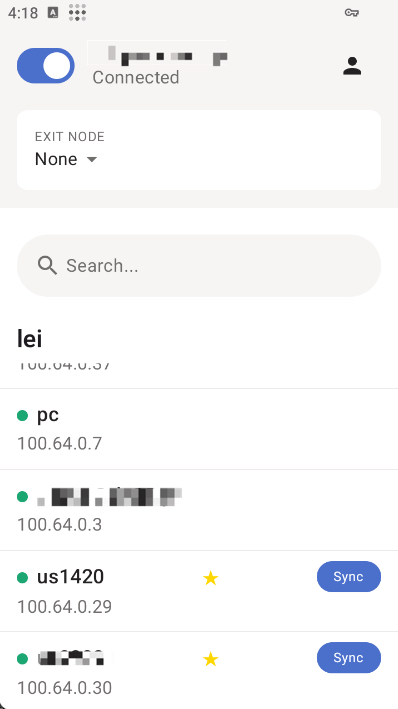

# Tailscale با Amnezia‑WG 2.0 (v1.88.2+)

[](https://github.com/LiuTangLei/tailscale/releases/latest) [](https://github.com/LiuTangLei/tailscale/releases/latest) [](../LICENSE)

نسخه تقویت‌شده Tailscale با Amnezia‑WG 2.0: ترافیک زائد، امضاهای پروتکل، و پنهان‌سازی دست‌دهی/هدر برای عبور از DPI و فیلترینگ. تا وقتی پارامترهای AWG را تنظیم نکنید، مانند نسخه رسمی عمل می‌کند.

زبان‌ها: [English](../README.md) | [中文](README-zh.md) | [فارسی](README-fa.md) | [Русский](README-ru.md)

مستندات AWG 1.5: [README-awg-v1.5.md](README-awg-v1.5.md)

## تغییرات ناسازگار (v1.88.2+)

- h1 تا h4 به «بازه [کمینه، بیشینه]» تبدیل شده‌اند و نباید با هم هم‌پوشانی داشته باشند
- s3 و s4 اضافه شده‌اند (علاوه بر s1 و s2)
- تولید خودکار تعاملی: هنگام اجرای `tailscale awg set` پیام زیر را می‌بینید:
  Do you want to generate random AWG parameters automatically? [Y/n]:
  با فشردن Enter همه پارامترها به جز i1–i5 به‌صورت امن و تصادفی تولید می‌شوند

پیکربندی‌های 1.x با 2.0 ناسازگارند. بخش «مهاجرت از 1.x» را ببینید.

## نصب

| پلتفرم | دستور |
| --- | --- |
| لینوکس | `curl -fsSL https://raw.githubusercontent.com/LiuTangLei/tailscale-awg-installer/main/install-linux.sh \| bash` |
| macOS* | `curl -fsSL https://raw.githubusercontent.com/LiuTangLei/tailscale-awg-installer/main/install-macos.sh \| bash` |
| ویندوز | `iwr -useb https://raw.githubusercontent.com/LiuTangLei/tailscale-awg-installer/main/install-windows.ps1 \| iex` |
| OpenWrt | [نصب OpenWrt](#نصب-openwrt) را ببینید |
| اندروید | دانلود APK از [releases](https://github.com/LiuTangLei/tailscale-android/releases) |

macOS: اسکریپت از نسخه CLI tailscaled استفاده می‌کند؛ اگر Tailscale.app رسمی پیدا شود، برای جلوگیری از تداخل پیشنهاد حذف می‌دهد.

اندروید می‌تواند پیکربندی AWG را از یک گره دیگر «دریافت» کند (دکمه Sync).



### نصب OpenWrt

برای دستگاه‌های OpenWrt از دستور زیر استفاده کنید:

```bash
wget -O /usr/bin/install.sh https://raw.githubusercontent.com/LiuTangLei/openwrt-tailscale-awg/main/install_en.sh && chmod +x /usr/bin/install.sh && /usr/bin/install.sh
```

برای کاربران چینی یا مناطقی با دسترسی محدود به GitHub، از آینه با نصب تعاملی استفاده کنید:

```bash
wget -O /usr/bin/install.sh https://ghfast.top/https://raw.githubusercontent.com/LiuTangLei/openwrt-tailscale-awg/main/install.sh && chmod +x /usr/bin/install.sh && /usr/bin/install.sh
```

این اسکریپت از [GuNanOvO/openwrt-tailscale](https://github.com/GuNanOvO/openwrt-tailscale) فورک شده است. با تشکر از GuNanOvO برای مشارکت متن‌باز!

### Docker Compose

در مخزن فایل `docker-compose.yml` وجود دارد که کانتینر `tailscaled` با پشتیبانی AWG را بالا می‌آورد:

1. سرویس را اجرا کنید: `docker compose up -d`
2. داخل کانتینر احراز هویت کنید: `docker compose exec tailscaled tailscale up` (برای Headscale خودمیزبان `--login-server https://your-headscale-domain` را اضافه کنید)
3. پس از ورود، همه دستورات تعاملی مشابه نصب محلی هستند، مثل `docker compose exec tailscaled tailscale awg sync`

پلتفرم‌های پشتیبانی‌شده همان موارد ایمیج رسمی Docker تیل‌اسکیل هستند.

## شروع سریع

نکته: `tailscale amnezia-wg` = `tailscale awg`

1. ورود

```bash
tailscale up
# Headscale
tailscale up --login-server https://your-headscale-domain
```

1. تنظیم AWG (تولید خودکار توصیه می‌شود)

```bash
tailscale awg set
```

در پیام تولید خودکار Enter را فشار دهید؛ همه پارامترها به جز i1–i5 ساخته می‌شوند.

1. همگام‌سازی روی دستگاه‌های دیگر

- دسکتاپ: `tailscale awg sync`
- اندروید: دکمه Sync

1. ریزتنظیم اختیاری: دوباره `tailscale awg set` را اجرا کنید؛ اگر امضا لازم نیست i1–i5 را خالی بگذارید.

1. دستورات مفید

```bash
tailscale awg get
tailscale awg reset
```

## قابلیت‌ها و مثال‌ها

- ترافیک زائد و امضاها (سازگار با گره‌های استاندارد)

```bash
tailscale awg set '{"jc":4,"jmin":64,"jmax":256}'
tailscale awg set '{"jc":2,"jmin":64,"jmax":128,"i1":"<b 0x40><r 12>"}'
```

- پنهان‌سازی پروتکل (همه گره‌ها باید همین نسخه را اجرا کنند؛ s1–s4 و h1–h4 یکسان، i1–i5 لازم نیست یکسان باشند)

```bash
tailscale awg set '{"s1":10,"s2":15,"s3":8,"s4":0}'
tailscale awg set '{"s1":10,"s2":15,"s3":8,"s4":0,"h1":{"min":100000,"max":200000},"h2":{"min":300000,"max":350000},"h3":{"min":400000,"max":450000},"h4":{"min":500000,"max":550000}}'
tailscale awg set '{"s1":10,"s2":15,"s3":8,"s4":0,"h1":{"min":100000,"max":200000},"h2":{"min":300000,"max":350000},"h3":{"min":400000,"max":450000},"h4":{"min":500000,"max":550000},"i1":"<b 0xc0><r 32><c><t>"}'
```

## مرجع پیکربندی

- پایه (سازگار با کلاینت استاندارد)

| کاربرد | JSON | سازگار |
| --- | --- | --- |
| فقط ترافیک زائد | `{"jc":4,"jmin":64,"jmax":256}` | ✅ |
| زائد + امضا | `{"jc":2,"jmin":64,"jmax":128,"i1":"<b 0xc0><r 16>"}` | ✅ |

- پیشرفته (همه گره‌ها s1–s4 و h1–h4 مشترک)

| کاربرد | مثال | توضیح |
| --- | --- | --- |
| پیشوند دست‌دهی | `{"s1":10,"s2":15,"s3":8,"s4":0}` | s1–s4 باید در همه گره‌ها یکسان باشد |
| بازه‌های هدر | `{"s1":10,"s2":15,"s3":8,"s4":0,"h1":{"min":100000,"max":200000},"h2":{"min":300000,"max":350000},"h3":{"min":400000,"max":450000},"h4":{"min":500000,"max":550000}}` | h1–h4 بازه‌های بدون هم‌پوشانی |
| ترکیبی | `{"jc":2,"s1":10,"s2":15,"s3":8,"s4":0,"h1":{"min":100000,"max":200000},"h2":{"min":300000,"max":350000},"h3":{"min":400000,"max":450000},"h4":{"min":500000,"max":550000},"i1":"<b 0xc0><r 16>"}` | امضا اختیاری |

پارامترها:

- jc (۰–۱۰)، jmin/jmax (۶۴–۱۰۲۴)
- i1–i5 زنجیره امضا اختیاری
- s1–s4 پیشوند/فیلدهای دست‌دهی (بین همه گره‌های AWG یکسان)
- h1–h4 بازه‌های هدر {"min": کمینه, "max": بیشینه}؛ چهار بازه نباید هم‌پوشانی داشته باشند؛ یا همه تنظیم شوند یا هیچ؛ بین همه گره‌ها یکسان

## پشتیبانی پلتفرم

| پلتفرم | معماری | وضعیت |
| --- | --- | --- |
| لینوکس | x86_64, ARM64 | ✅ کامل |
| macOS | Intel, Apple Silicon | ✅ کامل |
| ویندوز | x86_64, ARM64 | ✅ نصب‌کننده |
| OpenWrt | متنوع | ✅ اسکریپت |
| اندروید | ARM64, ARM | ✅ APK (فقط همگام‌سازی AWG) |

## مهاجرت از 1.x

1. همه گره‌ها را به v1.88.2+ ارتقا دهید
1. در صورت نیاز پیکربندی 1.x را ریست کنید

```bash
tailscale awg reset
```

1. روی هر دستگاه `tailscale awg set` را اجرا کرده و Enter بزنید (به جز i1–i5)
1. `tailscale awg get` را توزیع کنید یا `tailscale awg sync` را استفاده کنید
1. مطمئن شوید s1–s4 و h1–h4 بین گره‌ها یکسان و بازه‌های h1–h4 بدون هم‌پوشانی‌اند

توجه: پنهان‌سازی بین 1.x و 2.0 سازگار نیست.

## پیوندها

- Releases: <https://github.com/LiuTangLei/tailscale/releases>
- Android APK: <https://github.com/LiuTangLei/tailscale-android/releases>
- Issues نصب‌کننده: <https://github.com/LiuTangLei/tailscale-awg-installer/issues>
- مستندات Amnezia‑WG: <https://docs.amnezia.org/documentation/instructions/new-amneziawg-selfhosted>

## مجوز

BSD 3‑Clause (همانند پروژه upstream)

## 🚀 نصب

| پلتفرم                    | دستور / اقدام                                                                                            |
| ------------------------- | -------------------------------------------------------------------------------------------------------- | ----- |
| لینوکس                    | `curl -fsSL https://raw.githubusercontent.com/LiuTangLei/tailscale-awg-installer/main/install-linux.sh   | bash` |
| macOS\*                   | `curl -fsSL https://raw.githubusercontent.com/LiuTangLei/tailscale-awg-installer/main/install-macos.sh   | bash` |
| ویندوز (PowerShell ادمین) | `iwr -useb https://raw.githubusercontent.com/LiuTangLei/tailscale-awg-installer/main/install-windows.ps1 | iex`  |
| اندروید                   | دانلود APK: [نسخه‌ها](https://github.com/LiuTangLei/tailscale-android/releases)                          |

**\*نکته macOS:** به دلیل محافظت‌های یکپارچگی سیستم، نصب‌کننده از Tailscale فقط CLI استفاده می‌کند. اگر Tailscale.app رسمی شناسایی شود، شما برای جلوگیری از تعارض راهنمایی می‌شوید تا آن را حذف کنید.

نسخه اندروید در حال حاضر از همگام‌سازی پیکربندی AWG (دریافت) از یک دستگاه دیگر که قبلاً پیکربندی شده، پشتیبانی می‌کند. از دکمه Sync در داخل برنامه استفاده کنید:


### میرورها (اختیاری)

اگر GitHub کند یا مسدود است، می‌توانید یک میرور پیشوند (مثلاً `https://your-mirror-site.com`) را از طریق [gh-proxy](https://github.com/hunshcn/gh-proxy) خودتان میزبانی کنید:

```bash
# لینوکس
curl -fsSL https://your-mirror-site.com/https://raw.githubusercontent.com/LiuTangLei/tailscale-awg-installer/main/install-linux.sh | bash -s -- --mirror https://your-mirror-site.com

# macOS
curl -fsSL https://your-mirror-site.com/https://raw.githubusercontent.com/LiuTangLei/tailscale-awg-installer/main/install-macos.sh | bash -s -- --mirror https://your-mirror-site.com
```

```powershell
# ویندوز
$scriptContent = (iwr -useb https://your-mirror-site.com/https://raw.githubusercontent.com/LiuTangLei/tailscale-awg-installer/main/install-windows.ps1).Content; $scriptBlock = [scriptblock]::Create($scriptContent); & $scriptBlock -MirrorPrefix \'https://your-mirror-site.com/\'
```

سیاست اجرایی PowerShell (در صورت مسدود بودن): `Set-ExecutionPolicy RemoteSigned` (یا `Bypass -Scope Process`)

### نکات نصب macOS

- **استقرار فقط CLI**: استفاده از `tailscaled` متن‌باز (رابط utun) برای سازگاری کامل با نسخه‌های سفارشی
- **مدیریت تعارض برنامه**: تشخیص خودکار و ارائه گزینه حذف Tailscale.app رسمی برای جلوگیری از تعارض افزونه‌های سیستم

## ⚡ شروع سریع

> نکته: `tailscale amnezia-wg` → `tailscale awg` (نام مستعار)

۱. وارد شوید:

```bash
# رسمی
tailscale up
# Headscale
tailscale up --login-server https://your-headscale-domain
```

۲. دستگاه اول (تولید مقادیر اصلی مشترک):

```bash
tailscale awg set
```

برای H1 تا H4 کلمه `random` را وارد کنید تا مقادیر امن ۳۲ بیتی به صورت خودکار تولید شوند.

۳. همگام‌سازی دستگاه‌های دیگر:

- دسکتاپ: `tailscale awg sync`
- اندروید: روی دکمه Sync ضربه بزنید (تصویر بالا را ببینید)
  ۴. تنظیمات اختیاری برای هر دستگاه: دستور `tailscale awg set` را دوباره اجرا کرده و فقط فیلدهای غیرمشترک را تغییر دهید (S1/S2/H1–H4 را بدون تغییر باقی بگذارید).
  ۵. دستورات مفید:

```bash
tailscale awg get     # نمایش JSON
tailscale awg reset   # بازگشت به WireGuard معمولی
```

## 🛡️ ویژگی‌ها

### ترافیک زائد و امضاها

بسته‌های جعلی و امضاهای پروتکل را برای فرار از DPI اضافه کنید. با دستگاه‌های استاندارد Tailscale سازگار است:

```bash
# ترافیک زائد پایه
tailscale awg set \'{\"jc\":4,\"jmin\":64,\"jmax\":256}\'

# با امضاهای پروتکل (i1-i5)
tailscale awg set \'{\"jc\":2,\"jmin\":64,\"jmax\":128,\"i1\":\"<b 0xc0><r 16>\",\"i2\":\"<b 0x40><r 12>\"}\'
```

### پنهان‌سازی پروتکل

نیاز دارد که تمام دستگاه‌ها از این نسخه (fork) با تنظیمات یکسان استفاده کنند (امضاهای ix نیازی به تطابق ندارند):

```bash
# مبهم‌سازی دست‌دهی (s1/s2 باید در تمام دستگاه‌ها یکسان باشد)
tailscale awg set \'{\"s1\":10,\"s2\":15}\'

# با فیلدهای هدر (h1-h4 برای مبهم‌سازی پروتکل، باید در تمام دستگاه‌ها یکسان باشد)
tailscale awg set \'{\"s1\":10,\"s2\":15,\"h1\":3946285740,\"h2\":1234567890,\"h3\":987654321,\"h4\":555666777}\'

# ترکیب با امضاها (i1-i5 می‌تواند در هر دستگاه متفاوت باشد)
tailscale awg set \'{\"s1\":10,\"s2\":15,\"h1\":3946285740,\"h2\":1234567890,\"h3\":987654321,\"h4\":555666777,\"i1\":\"<b 0xc0><r 32><c><t>\"}\'
```

## 🎯 پیکربندی

پایه (با کلاینت‌های استاندارد کار می‌کند):

| نوع             | JSON                                                            | سازگار |
| --------------- | --------------------------------------------------------------- | ------ |
| فقط ترافیک زائد | `{\"jc\":4,\"jmin\":64,\"jmax\":256}`                           | ✅ بله |
| زائد + امضا     | `{\"jc\":2,\"jmin\":64,\"jmax\":128,\"i1\":\"<b 0xc0><r 16>\"}` | ✅ بله |

پیشرفته (تمام دستگاه‌ها باید از این نسخه استفاده کرده و مقادیر S1/S2/H1–H4 را به اشتراک بگذارند):

| هدف               | مثال                                                                                                               | نکات                           |
| ----------------- | ------------------------------------------------------------------------------------------------------------------ | ------------------------------ |
| پیشوندهای دست‌دهی | `{\"s1\":10,\"s2\":15}`                                                                                            | s1/s2: ۰–۶۴ بایت               |
| مبهم‌سازی هدر     | `{\"s1\":10,\"s2\":15,\"h1\":123456,\"h2\":789012,\"h3\":345678,\"h4\":901234}`                                    | همه h1–h4 را تنظیم کنید        |
| ترکیبی            | `{\"jc\":2,\"s1\":10,\"s2\":15,\"h1\":123456,\"h2\":789012,\"h3\":345678,\"h4\":901234,\"i1\":\"<b 0xc0><r 16>\"}` | ترافیک زائد/امضاها اختیاری است |

پارامترها:

- jc (۰–۱۰) با jmin/jmax (۶۴–۱۰۲۴): تعداد بسته‌های زائد و محدوده اندازه آن‌ها
- i1–i5: زنجیره امضای اختیاری (زبان کوچک با فرمت هگز)
- s1/s2 (۰–۶۴ بایت): پیشوندهای پدینگ دست‌دهی (باید در تمام دستگاه‌های AWG یکسان باشد)
- h1–h4 (اعداد صحیح ۳۲ بیتی): مبهم‌سازی هدر (همه یا هیچکدام؛ باید یکسان باشد). مقادیر تصادفی و منحصربه‌فرد انتخاب کنید (پیشنهاد: بین ۵ تا ۲۱۴۷۴۸۳۶۴۷)

نکات: تعداد زیاد بسته‌های زائد یا زنجیره‌های امضای طولانی باعث افزایش تأخیر و مصرف پهنای باند می‌شود.

## 📊 پشتیبانی از پلتفرم‌ها

| پلتفرم  | معماری               | وضعیت                       |
| ------- | -------------------- | --------------------------- |
| لینوکس  | x86_64, ARM64        | ✅ کامل                     |
| macOS   | Intel, Apple Silicon | ✅ کامل                     |
| ویندوز  | x86_64, ARM64        | ✅ نصب‌کننده                |
| اندروید | ARM64, ARM           | ✅ APK (AWG فقط همگام‌سازی) |

## 🔄 مهاجرت از Tailscale رسمی

۱. نصب‌کننده را اجرا کنید - فایل‌های باینری به طور خودکار جایگزین می‌شوند در حالی که تنظیمات شما حفظ می‌شود.
۲. احراز هویت و پیکربندی موجود شما بدون تغییر باقی می‌ماند.
۳. با مبهم‌سازی پایه شروع کنید: `tailscale awg set \'{\"jc\":4,\"jmin\":64,\"jmax\":256}\'`

## ⚠️ نکات

- تا زمانی که پیکربندی AWG اعمال نشود، مانند نسخه معمولی عمل می‌کند.
- ترافیک زائد/امضاها با کلاینت‌های استاندارد سازگار هستند (مقادیر می‌توانند در هر دستگاه متفاوت باشند).
- s1/s2 و h1–h4 نیاز دارند که هر دستگاه در حال ارتباط، مقادیر یکسانی را به اشتراک بگذارد.
- از پیکربندی‌های خود نسخه پشتیبان تهیه کنید (با استفاده از `tailscale awg get`).

## 🛠️ استفاده پیشرفته

### پیکربندی فیلد هدر (h1-h4)

مبهم‌سازی پروتکل برای فرار از شناسایی WireGuard. باید هر ۴ مقدار را تنظیم کنید یا هیچکدام:

```bash
# دستگاه اول: تولید مقادیر تصادفی (برای هر h1-h4 کلمه \'random\' را وارد کنید)
tailscale awg set  # هنگام درخواست، همه h1, h2, h3, h4 را تنظیم کنید

# دریافت پیکربندی JSON
tailscale awg get

# کل JSON را در دستگاه‌های دیگر کپی کنید (باید شامل همه h1-h4 باشد)
tailscale awg set \'{\"s1\":10,\"s2\":15,\"h1\":3946285740,\"h2\":1234567890,\"h3\":987654321,\"h4\":555666777}\'
```

### ایجاد امضاهای پروتکل

۱. ترافیک واقعی را با Wireshark ضبط کنید.
۲. الگوهای هگز را از هدرها استخراج کنید.
۳. فرمت را بسازید: `<b 0xHEX>` (ثابت)، `<r LENGTH>` (تصادفی)، `<c>` (شمارنده)، `<t>` (مهر زمانی).
۴. مثال: `<b 0xc0000000><r 16><c><t>` = هدر شبه-QUIC + ۱۶ بایت تصادفی + شمارنده + مهر زمانی.

### بسته‌های مبهم‌سازی I1–I5 (زنجیره امضا) و CPS (امضای پروتکل سفارشی)

قبل از هر دست‌دهی "ویژه" (هر ۱۲۰ ثانیه)، کلاینت ممکن است تا پنج بسته UDP سفارشی (I1–I5) را در فرمت CPS برای تقلید پروتکل ارسال کند.

**فرمت CPS:**

```text
i{n} = <tag1><tag2><tag3>...<tagN>
```

**انواع تگ:**

| تگ  | فرمت           | توضیحات                                     | محدودیت‌ها        |
| --- | -------------- | ------------------------------------------- | ----------------- |
| b   | `<b hex_data>` | بایت‌های ثابت برای شبیه‌سازی پروتکل‌ها      | طول دلخواه        |
| c   | `<c>`          | شمارنده بسته (۳۲ بیتی، ترتیب بایت شبکه)     | یکتا در هر زنجیره |
| t   | `<t>`          | مهر زمانی یونیکس (۳۲ بیتی، ترتیب بایت شبکه) | یکتا در هر زنجیره |
| r   | `<r length>`   | بایت‌های تصادفی امن از نظر رمزنگاری         | طول ≤ ۱۰۰۰        |

**مثال:**

```text
i1 = <b 0xf6ab3267fa><c><b 0xf6ab><t><r 10>
```

> ⚠️ اگر i1 تنظیم نشده باشد، کل زنجیره (I2–I5) نادیده گرفته می‌شود.

#### ضبط بسته‌های مبهم‌سازی واقعی با Wireshark

۱. Amnezia-WG را شروع کرده و پارامترهای i1–I5 را پیکربندی کنید.
۲. از Wireshark برای نظارت بر پورت UDP استفاده کنید (مثلاً فیلتر: `udp.port == 51820`).
۳. بسته‌های مبهم‌سازی را مشاهده و تحلیل کرده و در صورت نیاز امضاهای پروتکل را استخراج کنید.

برای جزئیات بیشتر، به [مستندات رسمی Amnezia-WG](https://docs.amnezia.org/documentation/instructions/new-amneziawg-selfhosted) مراجعه کنید.

## 🐛 عیب‌یابی

### تأیید نصب

```bash
tailscale version          # بررسی نسخه کلاینت
tailscale awg get          # تأیید پشتیبانی از Amnezia-WG
```

### مشکلات اتصال

```bash
# بازنشانی به WireGuard استاندارد
tailscale awg reset

# ابتدا تنظیمات پایه را امتحان کنید
tailscale awg set \'{\"jc\":2,\"jmin\":64,\"jmax\":128}\'

# بررسی لاگ‌ها (لینوکس)
sudo journalctl -u tailscaled -f
```

### مشکلات PowerShell در ویندوز

از حالت تعاملی برای جلوگیری از مشکلات مربوط به escape کردن JSON استفاده کنید:

```powershell
tailscale awg set  # راه‌اندازی تعاملی
```

## 🤝 پیوندها و پشتیبانی

- نسخه‌ها: [LiuTangLei/tailscale](https://github.com/LiuTangLei/tailscale/releases)
- فایل APK اندروید: [tailscale-android](https://github.com/LiuTangLei/tailscale-android/releases)
- مشکلات نصب‌کننده: [ردیاب مشکلات](https://github.com/LiuTangLei/tailscale-awg-installer/issues)
- مستندات Amnezia-WG: [مستندات رسمی](https://docs.amnezia.org/documentation/instructions/new-amneziawg-selfhosted)

## 📄 مجوز

مجوز BSD 3-Clause (مانند نسخه اصلی Tailscale)

---

**سلب مسئولیت**: فقط برای استفاده آموزشی و حفظ حریم خصوصی قانونی. مسئولیت رعایت قوانین بر عهده شماست.
