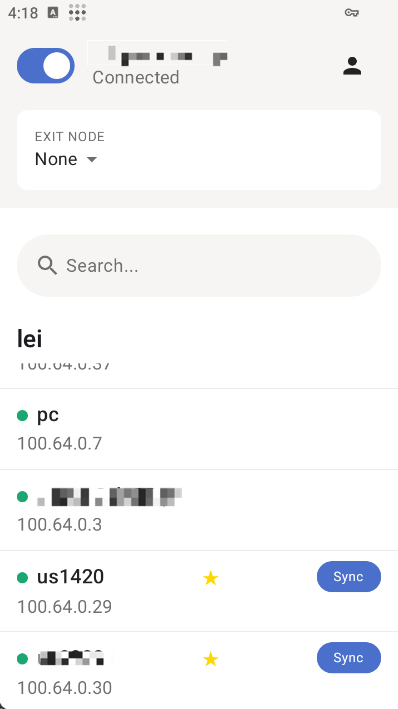

# Tailscale с AmneziaWG v2 и v3

[](https://github.com/LiuTangLei/tailscale/releases/latest)
[](#поддержка-платформ)
[](../LICENSE)

Этот проект устанавливает форк Tailscale с обфускацией AmneziaWG, сохраняя совместимость с официальным control plane Tailscale и Headscale. При отключенных AWG-параметрах он ведет себя как обычный Tailscale.

Начиная с `v1.102.2` поддерживаются два профиля: **AWG v3** (рекомендуется; защита заголовка, padding содержимого и случайные диапазоны таймингов) и **AWG v2** для совместимости со старыми узлами.

Языки: [English](../README.md) | [中文](README-zh.md) | [فارسی](README-fa.md) | [Русский](README-ru.md)

Архив старой версии AWG 1.5: [README-awg-v1.5.md](README-awg-v1.5.md).

## Установка

Установщики выбирают последний стабильный релиз. Если это допускает модель установки платформы, они сохраняют состояние CLI/службы и AWG-настройки, выполняют проверку миграции только для чтения и после установки показывают подсказку с учетом версии. Они не создают и не перезаписывают AWG-профиль автоматически. При переходе macOS с Tailscale.app на службу CLI/utun потребуется повторная авторизация, потому что эти модели установки не используют общее состояние.

| Платформа | Команда / действие |
| --- | --- |
| Linux | `curl -fsSL https://raw.githubusercontent.com/LiuTangLei/tailscale-awg-installer/main/install-linux.sh \| bash` |
| macOS* | `curl -fsSL https://raw.githubusercontent.com/LiuTangLei/tailscale-awg-installer/main/install-macos.sh \| bash` |
| Windows | `iwr -useb https://raw.githubusercontent.com/LiuTangLei/tailscale-awg-installer/main/install-windows.ps1 \| iex` |
| OpenWrt | См. [Установка OpenWrt](#установка-openwrt) |
| Android | Загрузите APK из [releases](https://github.com/LiuTangLei/tailscale-android/releases) |
| iOS | Экспериментальный [AwgScale](https://github.com/LiuTangLei/AwgScale); системный VPN требует TrollStore или подпись с Packet Tunnel entitlement |

- macOS: установщик использует CLI-версию `tailscaled`. Если обнаружен официальный Tailscale.app, установщик запросит подтверждение и временно переместит App bundle для отката. Отключенное пользователем System/Network Extension нельзя включить обратно автоматически.
- Мобильные клиенты Android и iOS поддерживают ручную настройку AWG и синхронизацию AWG-настроек с других узлов.
- iOS: обычная подпись поддерживает app-only функции; системный VPN/AWG требует TrollStore или Packet Tunnel entitlement.



## Docker Compose

В репозитории есть `docker-compose.yml` для запуска `tailscaled` с поддержкой AWG.

- Состояние хранится в каталоге `./tailscale-state` рядом с compose-файлом, поэтому состояние узла и параметры AWG сохраняются после перезапуска контейнера и перезагрузки хоста.
- Если вы переходите со старого bind mount `/var/lib/tailscale:/var/lib/tailscale`, перед копированием остановите все процессы, использующие это состояние. Нельзя одновременно запускать host daemon и контейнер с одним состоянием узла:

```bash
docker compose down
# Если host-служба использует тот же каталог, выберите подходящий init:
# systemd: sudo systemctl stop tailscaled
# OpenRC:  sudo rc-service tailscaled stop || sudo rc-service tailscale stop
mkdir -p ./tailscale-state
cp -a /var/lib/tailscale/. ./tailscale-state/
# обновите docker-compose.yml
docker compose pull
docker compose up -d
```

Базовый сценарий:

1. Поднимите сервис: `docker compose up -d`
2. Авторизуйтесь в контейнере: `docker compose exec tailscaled tailscale up`
3. Выполняйте AWG-команды так же, например: `docker compose exec tailscaled tailscale awg sync`

Перед выбором v3 проверьте `docker compose exec tailscaled tailscale version`: версия core должна быть не ниже `v1.102.2`.

Если вы используете Headscale, добавьте к `tailscale up` параметр `--login-server https://your-headscale-domain`.

Здесь легко перепутать два имени: сервис/контейнер Compose называется `tailscaled`, а CLI-команда внутри контейнера — `tailscale`. Поэтому прямой Docker-вариант выглядит так:

```bash
docker exec -it tailscaled tailscale status
```

`docker exec tailscale status` не то же самое: Docker будет искать контейнер с именем `tailscale`, а затем попытается запустить `status` как программу внутри него.

Чтобы запускать `tailscale ...` прямо на Linux-хосте, сохраните alias в файле запуска shell:

```bash
printf "\nalias tailscale='docker exec -it tailscaled tailscale'\n" >> ~/.bashrc && . ~/.bashrc
```

Для Zsh используйте `~/.zshrc`:

```bash
printf "\nalias tailscale='docker exec -it tailscaled tailscale'\n" >> ~/.zshrc && . ~/.zshrc
```

После этого можно запускать:

```bash
tailscale up
tailscale awg get
```

## Установка OpenWrt

Стандартная команда:

```bash
wget -O /usr/bin/install.sh https://raw.githubusercontent.com/LiuTangLei/openwrt-tailscale-awg/main/install_en.sh && chmod +x /usr/bin/install.sh && /usr/bin/install.sh
```

Для регионов с ограниченным доступом к GitHub:

```bash
wget -O /usr/bin/install.sh https://ghfast.top/https://raw.githubusercontent.com/LiuTangLei/openwrt-tailscale-awg/main/install.sh && chmod +x /usr/bin/install.sh && /usr/bin/install.sh
```

Скрипт основан на [GuNanOvO/openwrt-tailscale](https://github.com/GuNanOvO/openwrt-tailscale).

## Зеркала

Если GitHub работает медленно или недоступен, можно использовать собственное префиксное зеркало, например `https://your-mirror-site.com`:

```bash
# Linux
curl -fsSL https://your-mirror-site.com/https://raw.githubusercontent.com/LiuTangLei/tailscale-awg-installer/main/install-linux.sh | bash -s -- --mirror https://your-mirror-site.com

# macOS
curl -fsSL https://your-mirror-site.com/https://raw.githubusercontent.com/LiuTangLei/tailscale-awg-installer/main/install-macos.sh | bash -s -- --mirror https://your-mirror-site.com
```

```powershell
# Windows
$scriptContent = (iwr -useb https://your-mirror-site.com/https://raw.githubusercontent.com/LiuTangLei/tailscale-awg-installer/main/install-windows.ps1).Content; $scriptBlock = [scriptblock]::Create($scriptContent); & $scriptBlock -MirrorPrefix 'https://your-mirror-site.com/'
```

Если PowerShell блокирует выполнение, используйте `Set-ExecutionPolicy RemoteSigned` или `Bypass -Scope Process`.

## Быстрый старт

Подсказка: `tailscale amnezia-wg` равно `tailscale awg`.

1. Войдите в сеть:

```bash
# Официальный control plane
tailscale up

# Headscale
tailscale up --login-server https://your-headscale-domain
```

2. Настройте AWG:

```bash
tailscale awg set
```

В `v1.102.2+` нажмите Enter, чтобы сгенерировать рекомендуемый профиль AWG v3, либо введите `2`, чтобы создать совместимый профиль AWG v2.

3. Синхронизируйте другие устройства:

- CLI-платформы (Linux/macOS/Windows/OpenWrt): `tailscale awg sync`
- Android и iOS (AwgScale): настройте AWG вручную в приложении или синхронизируйте настройки с другого узла

После успешного `tailscale awg set` или `tailscale awg sync` следуйте запросу перезапуска; `v1.102.2` по умолчанию рекомендует перезапуск после обеих команд.

4. Проверяйте или сбрасывайте настройки при необходимости:

```bash
tailscale awg get
tailscale awg validate # v1.102.2+
tailscale awg reset
```

## Готовые пресеты

| Цель | Пример | Совместимость |
| --- | --- | --- |
| Базовый мусорный трафик | `tailscale awg set '{"jc":4,"jmin":64,"jmax":256}'` | Работает со стандартными узлами Tailscale |
| Мусорный трафик + сигнатуры | `tailscale awg set '{"jc":2,"jmin":64,"jmax":128,"i1":"<b 0x40><r 12>"}'` | Работает со стандартными узлами Tailscale |
| Маскировка рукопожатия | `tailscale awg set '{"s1":10,"s2":15,"s3":8,"s4":0}'` | Все AWG-узлы должны иметь одинаковые `s1`-`s4` |
| Полная маскировка | `tailscale awg set '{"s1":10,"s2":15,"s3":8,"s4":0,"h1":{"min":100000,"max":200000},"h2":{"min":300000,"max":350000},"h3":{"min":400000,"max":450000},"h4":{"min":500000,"max":550000}}'` | Все AWG-узлы должны иметь одинаковые `s1`-`s4` и `h1`-`h4` |
| Полная маскировка + сигнатуры | `tailscale awg set '{"s1":10,"s2":15,"s3":8,"s4":0,"h1":{"min":100000,"max":200000},"h2":{"min":300000,"max":350000},"h3":{"min":400000,"max":450000},"h4":{"min":500000,"max":550000},"i1":"<b 0xc0><r 32><t>"}'` | `i1`-`i5` могут отличаться, но `s1`-`s4` и `h1`-`h4` должны совпадать |

## Справочник по параметрам

- `jc`, `jmin`, `jmax`: количество и размер мусорных пакетов.
- `i1`-`i5`: необязательная CPS-цепочка сигнатур.
- `s1`-`s4`: поля префикса или padding в рукопожатии; должны совпадать у всех AWG-узлов.
- `h1`-`h4`: диапазоны полей заголовков в виде `{"min": low, "max": high}`. Эффективные диапазоны не должны пересекаться, а общие значения должны совпадать у всех AWG-узлов.

AWG v3 также добавляет `header_protection_key`, `content_padding_addition`, `rekey_after_time`, `rekey_timeout`, `reject_after_time`, `keepalive_timeout` и `max_handshake_attempts`. Ключ защиты заголовка и общие поля должны совпадать у взаимодействующих v3-узлов; локальные диапазоны padding и таймингов могут отличаться. Не включайте v3 только на одной стороне соединения.

Слишком большие значения мусорного трафика и длинные сигнатурные цепочки увеличивают задержку и расход трафика.

## Поддержка платформ

| Платформа | Архитектура | Статус |
| --- | --- | --- |
| Linux | x86_64, ARM64 | ✅ Полная |
| macOS | Intel, Apple Silicon | ✅ Полная |
| Windows | x86_64, ARM64 | ✅ Установщик |
| OpenWrt | Различные | Отдельный релиз; проверьте версию core |
| Android | Universal APK (ARM64, ARM, x86_64, x86) | ✅ Ручная настройка AWG + sync |
| iOS | iPhone/iPad (iOS 15+) | ✅ Экспериментальный клиент (ручная настройка AWG + sync) |

OpenWrt, Android и iOS публикуются отдельно. Перед синхронизацией v3 проверьте фактическую версию клиента/ядра; если хотя бы один узел еще не поддерживает v3, используйте v2.

## Дополнительно: сигнатуры протоколов

Формат CPS:

```text
i{n} = <tag1><tag2>...<tagN>
```

Распространенные теги:

- `<b 0xHEX>`: статические байты
- `<r N>`: криптографически стойкие случайные байты
- `<rc N>`: случайные ASCII-буквы
- `<rd N>`: случайные десятичные цифры
- `<t>`: timestamp

Пример:

```text
i1 = <b 0xf6ab3267fa><b 0xf6ab><t><r 10>
```

> Совместимость: AmneziaWG удалил старый счетчик CPS `<c>` при переработке AWG 2 в `amneziawg-go v0.2.16`; этот fork унаследовал изменение в `v1.98.1`, поэтому удалите этот тег из старых значений `i1`-`i5`.

## Устранение неполадок

Проверьте установку:

```bash
tailscale version
tailscale awg get
tailscale awg validate # v1.102.2+
```

Если соединение ломается, сначала вернитесь к обычному WireGuard и попробуйте простой пресет:

```bash
tailscale awg reset
tailscale awg set '{"jc":2,"jmin":64,"jmax":128}'
sudo journalctl -u tailscaled -f
```

В Windows PowerShell удобнее использовать интерактивный режим:

```powershell
tailscale awg set
```

## Ссылки

- Releases: <https://github.com/LiuTangLei/tailscale/releases>
- Android APK: <https://github.com/LiuTangLei/tailscale-android/releases>
- iOS клиент (AwgScale): <https://github.com/LiuTangLei/AwgScale>
- Установщик (issues): <https://github.com/LiuTangLei/tailscale-awg-installer/issues>
- Amnezia-WG docs: <https://docs.amnezia.org/documentation/instructions/new-amneziawg-selfhosted/#how-to-extract-a-protocol-signature-for-amneziawg-manually>

## Лицензия

BSD 3-Clause, как и у upstream Tailscale.
